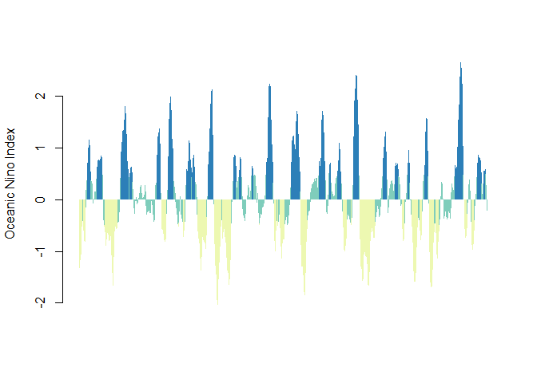

<!-- README.md is generated from README.Rmd. Please edit that file -->

[](https://www.gnu.org/licenses/gpl-3.0)
[](https://travis-ci.org/boshek/rsoi)
[](https://ci.appveyor.com/project/boshek/rsoi)

[](https://cran.r-project.org/package=rsoi)
[](https://CRAN.R-project.org/package=rsoi)
[](https://cran.r-project.org/web/checks/check_results_rsoi.html)

# rsoi

An R package to download the most up to date of these climate indices:

  - Southern Oscillation Index
  - Oceanic Nino Index
  - North Pacific Gyre Oscillation
  - North Atlantic Oscillation
  - Arctic Oscillation
  - Antarctic Oscillation
  - Multivariate ENSO Index Version 2

## Installation

For the development version

``` r
install.packages("rsoi")

library(rsoi)
library(tibble)
```

## Usage

Download Oceanic Nino Index data

``` r
oni <- download_oni()
head(oni)
#> # A tibble: 6 x 7
#>   Date       Month  Year dSST3.4   ONI ONI_month_window phase             
#>   <date>     <ord> <int>   <dbl> <dbl> <chr>            <fct>             
#> 1 1950-01-01 Jan    1950   -1.62 NA    JF               NA                
#> 2 1950-02-01 Feb    1950   -1.32 -1.34 JFM              Warm Phase/El Nino
#> 3 1950-03-01 Mar    1950   -1.07 -1.17 FMA              Warm Phase/El Nino
#> 4 1950-04-01 Apr    1950   -1.11 -1.18 MAM              Warm Phase/El Nino
#> 5 1950-05-01 May    1950   -1.37 -1.07 AMJ              Warm Phase/El Nino
#> 6 1950-06-01 Jun    1950   -0.74 -0.85 MJJ              Warm Phase/El Nino
```

And a quick plot to illustrate the data:

``` r
barcols <- c('#edf8b1','#7fcdbb','#2c7fb8')

barplot(oni$ONI, names.arg = oni$Date, ylab = "Oceanic Nino Index" , 
    col = barcols[oni$phase], border = NA, space = 0,
    xaxt = "n")
```

<!-- -->

## Inspired by

The idea for this package borrows heavily from the rpdo package. The
initial efforts by these authors are gratefully acknowledged. The rpdo
github page can be found here:
[rpdo](https://github.com/poissonconsulting/rpdo)

## Data Sources

  - Southern Oscillation Index:
    <https://www.ncdc.noaa.gov/teleconnections/enso/indicators/soi/>
  - Oceanic Nino Index data:
    <http://www.cpc.ncep.noaa.gov/products/analysis_monitoring/ensostuff/detrend.nino34.ascii.txt>
  - Northern Pacific Gyre Oscillation:
    <http://www.o3d.org/npgo/data/NPGO.txt>
  - North Atlantic Oscillation:
    <https://www.ncdc.noaa.gov/teleconnections/nao/data.csv>
  - Arctic Oscillation:
    <https://www.ncdc.noaa.gov/teleconnections/ao/data.csv>
  - Anarctic Oscillation:
    <https://www.cpc.ncep.noaa.gov/products/precip/CWlink/daily_ao_index/aao/monthly.aao.index.b79.current.ascii>
  - Multivariate ENSO Index Version 2 (MEI.v2):
    <https://www.esrl.noaa.gov/psd/enso/mei/>

## Helpful References

[In Watching for El Niño and La Niña, NOAA Adapts to Global
Warming](https://www.climate.gov/news-features/understanding-climate/watching-el-ni%C3%B1o-and-la-ni%C3%B1a-noaa-adapts-global-warming)

[L’Heureux, M. L., Collins, D. C., & Hu, Z.-Z. (2012, March.). Linear
trends in sea surface temperature of the tropical Pacific Ocean and
implications for the El Niño-Southern Oscillation. Climate
Dynamics, 1–14.
doi:10.1007/s00382-012-1331-2](https://link.springer.com/article/10.1007%2Fs00382-012-1331-2)

[The Victoria mode in the North Pacific linking extratropical sea level
pressure variations to
ENSO](http://onlinelibrary.wiley.com/doi/10.1002/2014JD022221/pdf)

Please note that the ‘rsoi’ project is released with a [Contributor Code
of
Conduct](https://github.com/boshek/rsoi/blob/master/CODE_OF_CONDUCT.md).
By contributing to this project, you agree to abide by its terms.
